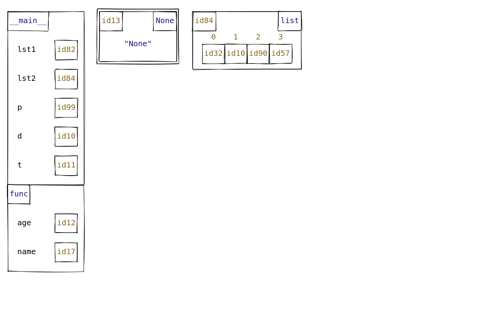
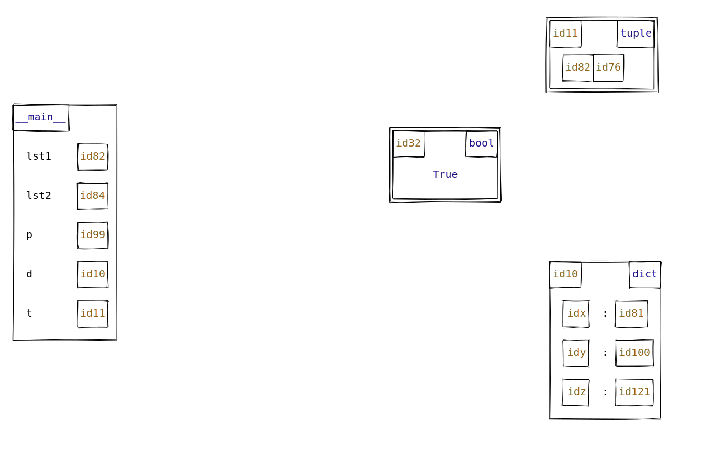
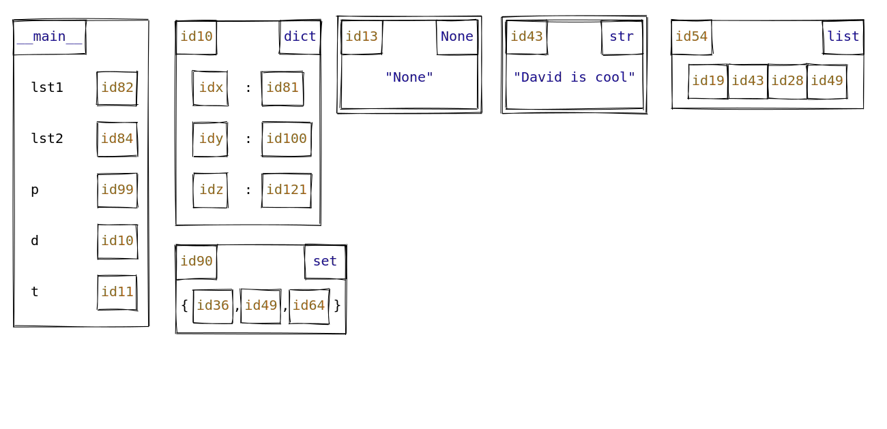

# Memory model diagrams

This package generates memory model diagrams for Python code in the style of CSC110/111/148 at the University of Toronto.
This uses the [Rough.js](https://roughjs.com/) Javascript library to emulate the look of hand-drawn diagrams.

**Note**: this project is currently experimental, and may undergo significant changes before stabilizing.

## Installation (users)

1. Install [Node.js](https://nodejs.org/en/).
2. Install the `memory-models-rough` package from GitHub (it is currently not on npm):

    ```console
    $ npm install git+https://github.com/david-yz-liu/memory-models-rough.git -g
    ```

    _Note_: omit the `-g` flag if you want to install the package into just the current working directory.

## Installation (developers)

1. First, clone this repository.
2. Install [Node.js](https://nodejs.org/en/).
3. Open a terminal in your local code of the repository, and then run:

    ```console
    $ npm install
    ```

4. Compile the Javascript assets using [webpack](https://webpack.js.org/guides/getting-started/):

    ```console
    $ npm run build
    ```

That's it!
You should then be able to try out the demo in the [Example usage](#example-usage) section below.

### Automatic Javascript compilation

Rather than running `npm run build` to recompile your Javascript bundle every time you make a change, you can instead run the following command:

```console
$ npm run watch
```

This will use `webpack` to watch for changes to the Javascript source files and recompile them automatically.

*Note*: this command will keep running until you manually terminate it (Ctrl + C), and so you'll need to open a new terminal window to enter new terminal commands like running the demo below.


## Usage

The only function that a user will ever have to call is `user_functions.draw`.

This function has three parameters:
1. `objs`: The array of objects (including stack-frames) to be drawn. Each object must follow
a strict structure which is thoroughly outlined in the `object_structure.md` file.
2. `automation`: A boolean, indicating whether the location of the memory-model boxes should
be automatically generated. If this is false, the user must x and y attributes for each object
   (representing the object's coordinates).
3. `configuration`: A JS object representing configuration such as the user-specified width. 
Defining a `width` property is mandatory if `automation` is `true`.

(**Note**: If the array of objects to be drawn is stored in a JSON file, the user can simply choose to pass the path to
that JSON as the first parameter to `draw`. The implementation automatically handles the case that `typeof objs === "string"`.
)

### Simple Example
Before showing the full capabilities of the project, here is a simple example to get you started, consisting of
one stack-frame and two objects.

```javascript
const { draw } = require("../../dist/memory_models_rough.node.js");

const objects = [
   {"isClass": true, "name": "__main__", "id": null, "value": {"lst1": 82, "lst2": 84, "p": 99, "d": 10, "t": 11}, "stack_frame": true},
   {"isClass": false, "name": "str", "id": 19, "value": "David is cool!"},
   {"isClass": false, "name": "int", "id": 13, "value": 7}
]

const m = draw(
        objects,
        true,
        {width: 1300}
)

m.save("simple_demo.svg")
```


### Automation Example
One of the main capabilities offered is the automatic generation of coordinates for objects
passed by the user.

```javascript
// The array version of automation.js (in automation.js same objects are used, but they are in the JSON file format.)
const { draw } = require("user_functions");

const objs = [
   {"isClass": true, "name": "__main__", "id": null, "value": {"lst1": 82, "lst2": 84, "p": 99, "d": 10, "t": 11}, "stack_frame": true},
   {"isClass": true, "name": "func", "id": null, "value": {"age": 12, "name": 17}, "stack_frame": true},
   {"isClass": false, "name": "list", "id": 84, "value": [32, 10, 90, 57], "show_indexes": true},
   {"isClass": false, "name": "None", "id": 13, "value": "None"}
]

const configuration = {width: 1300, padding: 30, top_margin: 30, bottom_margin: 40, left_margin: 20, right_margin:30};


const m = draw(objs, true, configuration)


m.save("~/Desktop/demo.svg")
```

Running node `automation_demo.js` creates a file `automation_demo.svg` that contains the following image:




### Manual Coordinates Example

Despite the automation capabilities, the user may still wish to hardcode the coordinates of the memory boxes.
To do this, they must set the `automation` parameter of the `draw` function to false (signifying that no automation
should take place), and supply `x` and `y` coordinates for *every* object in the array (there is no notion of
"partial" automation).

Note that in the case of manual coordinates, the `configuration` parameter can provide no additional functionality,
and an empty object (`{}`) will suffice.

```javascript
// The array version of automation.js (in automation.js same objects are used, but they are in the JSON file format.)
const { draw } = require("user_functions");

const objs = [
   {"isClass": true, "x": 25, "y":200, "name": "__main__", "id": null, "value": {"lst1": 82, "lst2": 84, "p": 99, "d": 10,
         "t": 11}, "stack_frame": true},
   {"isClass": false, "x": 1050, "y": 500, "name": "dict", "id": 10, "value": {"x": 81, "y": 100, "z": 121}},
   {"isClass": false, "x": 1050, "y": 40, "name": "tuple", "id": 11, "value": [82, 76]},
   {"isClass": false, "x": 750, "y": 250, "name": "bool", "id": 32, "value": true}
]
const configuration = {};

const m = draw(objs, false, configuration)


m.save("~/Desktop/manual_demo.svg")
```

Running node `manual_demo.js` creates a file `manual_demo.svg` that contains the following image:




### Style Features for Drawing
 
The package allows user to define their own configuration for the style of the drawings. To achieve this, we utilize 
rough package (see the documentation of rough package) and SVG (see the documentation of SVG for details). Rough package
is used for style configurations related to boxes (that are drawn) and SVG is mainly related to texts.
Moreover, we have created  a few presets that the user can utilize (without creating custom-made style)
.We allow user to  pass in a JavaScript object, as well an array (which can include a mixture of presets and user-defined styles).
Therefore, the user needs to follow the guidelines(documentation) of the aforementioned packages **and** the instructions in the `style.md` file
on how to pass these *style* arguments. We strongly recommend the user to consult the `style.md` file. 

Also, we provide pre-sets that users can utilize. Hence, user can pass these presets (following
the instructions in the `style.md` file)

The code for generating a memory model diagram with built-in default style will look similar to this:

```javascript
const objs = [
   {isClass: true, x: 25, y:200, name: "__main__", id: null, value: {lst1: 82, lst2: 84, p: 99, d: 10, t: 11},stack_frame: true},
   {isClass: false, x: 350, y: 350, name: "list", id: 54, value: [19, 43, 28, 49]},
   {isClass: false, x: 750, y: 500, name: "str", id: 43, value: "David is cool"},
   {isClass: false, x: 1050, y: 260, name: "set", id: 90, value: [36, 49, 64]},
   {isClass: false, x: 1050, y: 500, name: "dict", id: 10, value: {x: 81, y: 100, z: 121}},
   {isClass: false, x: 750, y: 750, name: "None", id: 13, value: "None"}
]
```
The produced image will be as follows:



On the other hand, the same memory model diagram can be created with utilizing styling features s follows:

```javascript
const objs = [
   {isClass: true, x: 25, y:200, name: "__main__", id: null,
      value: {lst1: 82, lst2: 84, p: 99, d: 10, t: 11},
      stack_frame: true,
      style:['highlight']
   },
   {isClass: false, x: 350, y: 350, name: "list", id: 54, value: [19, 43, 28, 49],
      style: {"text_id" : {"font-style": "italic", "font-size":"x-large"}}},
   {isClass: false, x: 750, y: 500, name: "str", id: 43, value: "David is cool",
      style: "highlight"},
   {isClass: false, x: 1050, y: 260, name: "set", id: 90, value: [36, 49, 64]},
   {isClass: false, x: 1050, y: 500, name: "dict", id: 10, value: {x: 81, y: 100, z: 121},
      style: {"text_id" : {"font-style" : "italic"}}},
   {isClass: false, x: 750, y: 750, name: "None", id: 13, value: "None",
      style:{
         "text_value" : {"font-style" : "italic"},
         'box_id': {fill: 'red', fillStyle: "dots"},
         'box_type': {fill: "red", fillStyle: "solid"},
         "box_container": {fill:"black", fillStyle: "solid"}}
   }
]
```

The resulting diagram will be like this:


### Blank Spaces Example
In many cases, the user might want to have blank spaces in the memory model when in `automation === true` mode in the
`draw` function (if the user is "hard coding" coordinates, then he can easily include spaces wherever he desires).

To define a blank box, you specify it as an object in the array (the classic array of objects) with three attributes:
- `name: "BLANK"`
- `width: ...` (the desired width of the blank space)
- `height: ...` (the desired height of the blank space)

All these attributes are mandatory, and any additional attributes will not have any effect whatsoever in the
rendering of the blank space.
Furthermore, note that `configuration.sort_by` should be `null`, as otherwise you cannot control where the
blank spaces will be located.

In the below example we have added three blank spaces of varying dimensions.
 
```javascript
const {draw} = require("../../dist/memory_models_rough.node.js");

const WIDTH = 1300;

const listOfObjs = [
   {"isClass": true, "name": "__main__", "id": null, "value": {"lst1": 82, "lst2": 84, "p": 99, "d": 10, "t": 11}, "stack_frame": true},
   {"name": "BLANK", "width": 100, "height": 200, "stack_frame" : true},
   {"isClass": true, "name": "func", "id": null, "value": {"age": 12, "name": 17}, "stack_frame": true},
   {"isClass": false, "name": "list", "id": 82, "value": [19, 43, 28, 49]},
   {"isClass": false, "name": "list", "id": 84, "value": [32, 10, 90, 57], "show_indexes": true},
   {"isClass": false, "name": "int", "id": 19, "value": 1969},
   {"name": "BLANK", "width": 100, "height": 200},
   {"isClass": false, "name": "bool", "id": 32, "value": true},
   {"isClass": false, "name": "str", "id": 43, "value": "David is cool"},
   {"name": "BLANK", "width": 200, "height": 150},
   {"isClass": false, "name": "tuple", "id": 11, "value": [82, 76]},
]

const configuration = {width: WIDTH, padding: 30, right_margin: 20, bottom_margin: 20, sort_by: null};

const m = draw(
        listOfObjs,
        true,
        configuration
)

m.save("blankspaces_demo.svg")
```

Running node `blankspaces_demo.js` creates a file `blankspaces_demo.svg` that contains the following image:

