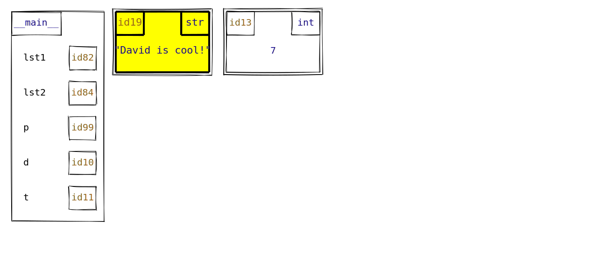

# MemoryViz: Creating memory model diagrams

This package generates memory model diagrams for Python code in the style of CSC110/111/148 at the University of Toronto.
This uses the [Rough.js](https://roughjs.com/) Javascript library to emulate the look of hand-drawn diagrams.

**Note**: this project is currently experimental, and may undergo significant changes before stabilizing.

## Installation (users)

1. Install [Node.js](https://nodejs.org/en/).
2. Install the `memory-viz` package:

    ```console
    $ npm install memory-viz
    ```

## Sample usage

Running the following file:

```js
const { draw } = require("memory-viz");

const objects = [
    {
        type: ".frame",
        name: "__main__",
        id: null,
        value: { lst1: 82, lst2: 84, p: 99, d: 10, t: 11 },
    },
    {
        type: "str",
        id: 19,
        value: "David is cool!",
        style: ["highlight"],
    },
    {
        type: "int",
        id: 13,
        value: 7,
    },
];

const m = draw(objects, true, { width: 1300 });

m.save("simple_demo.svg");
```

produces a file `simple_demo.svg` that looks like the following:



For more information, check out the project [documentation website](https://www.cs.toronto.edu/~david/memory-viz/) and [demo](https://www.cs.toronto.edu/~david/memory-viz/demo/).

## Developers

### Installation

1. First, clone this repository.
2. Install [Node.js](https://nodejs.org/en/).
3. Open a terminal in your local code of the repository, and then run:

    ```console
    $ npm install
    ```

4. Compile the Javascript assets using [webpack](https://webpack.js.org/guides/getting-started/):

    ```console
    $ npm run build-dev --workspace=memory-viz
    ```

5. Install the pre-commit hooks to automatically format your code when you make commits:

    ```console
    $ npx husky install
    $ npm pkg set scripts.prepare="husky install"
    $ npx husky add .husky/pre-commit "npx lint-staged"
    ```

### Automatic Javascript compilation

Rather than running `npm run build-dev` to recompile your Javascript bundle every time you make a change, you can instead run the following command:

```console
$ npm run watch --workspace=memory-viz
```

This will use `webpack` to watch for changes to the Javascript source files and recompile them automatically.

_Note_: this command will keep running until you manually terminate it (Ctrl + C), and so you'll need to open a new terminal window to enter new terminal commands like running the demo below.

### Running tests

To run the test suite, execute the following command:

```console
$ npm run test --workspace=memory-viz
```
